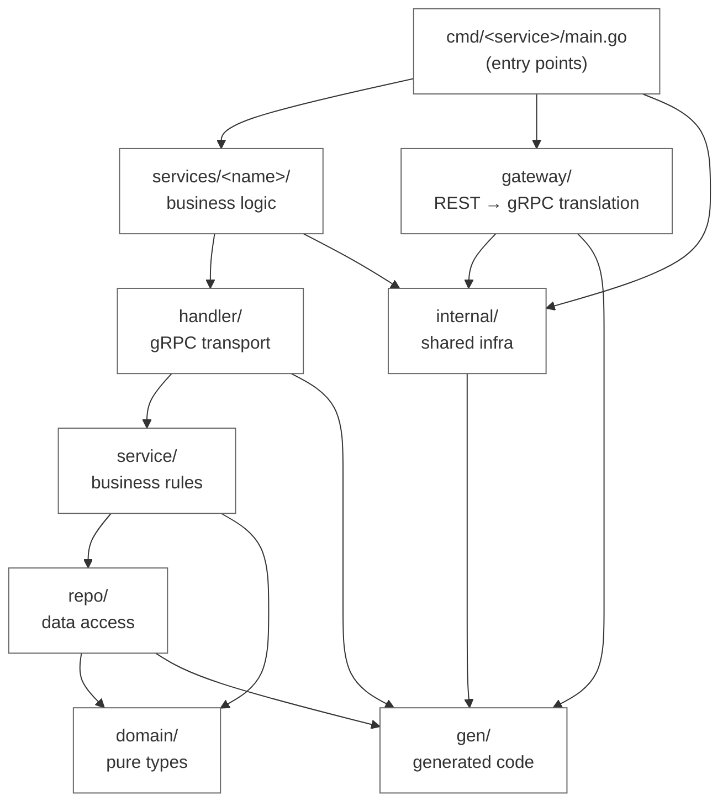
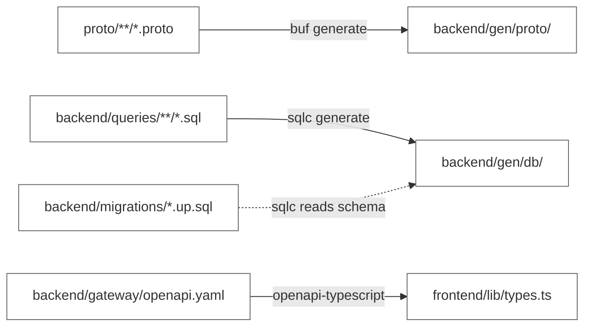

# Code Architecture
 
This document describes how the codebase is organized, the reasoning behind each structural choice, and the conventions the project follows.

The repository is a monorepo containing a Go backend (multiple gRPC services behind a REST gateway) and a Next.js frontend. Other concerns — observability stack configuration, load testing, deployment, CI/CD — live in adjacent directories and are documented in separate files.
 
## Repository Layout
 
```
ecommerce-demo/
├── README.md                           # Project entry point & purchase flow design
├── Makefile                            # proto, sqlc, test, run, migrate targets
├── .env.example
├── docker-compose.yml                  # Local dev: postgres, redis, backend, frontend
│
├── proto/                              # gRPC contracts (single source of truth)
│   ├── buf.yaml
│   ├── buf.gen.yaml
│   ├── catalog/v1/catalog.proto
│   ├── cart/v1/cart.proto
│   └── order/v1/order.proto
│
├── backend/                            # One Go module, multiple binaries
│   ├── go.mod
│   ├── go.sum
│   ├── sqlc.yaml
│   ├── Dockerfile                      # Multi-stage, --target <service>
│   │
│   ├── cmd/                            # One main.go per binary
│   │   ├── gateway/main.go
│   │   ├── catalog/main.go
│   │   ├── cart/main.go
│   │   ├── order/main.go
│   │   ├── outbox-publisher/main.go    # Async worker
│   │   └── cleanup-worker/main.go      # Async worker
│   │
│   ├── internal/                       # Shared infra, not importable externally
│   │   ├── observability/
│   │   │   ├── tracing.go              # OTel tracer setup
│   │   │   ├── metrics.go              # Prometheus registry
│   │   │   └── logging.go              # slog JSON handler
│   │   ├── config/
│   │   │   └── config.go               # Env parsing + validation
│   │   ├── database/
│   │   │   ├── pool.go                 # pgx pool setup
│   │   │   └── migrate.go              # Migration runner
│   │   ├── middleware/
│   │   │   ├── auth.go
│   │   │   ├── request_id.go
│   │   │   ├── recovery.go
│   │   │   └── otel.go                 # Tracing interceptors
│   │   └── grpcclient/
│   │       └── client.go               # Retry/timeout/circuit-breaker config
│   │
│   ├── services/                       # Business logic, one folder per service
│   │   ├── catalog/
│   │   │   ├── handler/                # gRPC handlers (transport only)
│   │   │   ├── service/                # Business rules
│   │   │   ├── repo/                   # Data access (wraps sqlc)
│   │   │   └── domain/                 # Pure types, no deps
│   │   ├── cart/
│   │   │   └── ... (same shape)
│   │   └── order/
│   │       └── ... (same shape)
│   │
│   ├── gateway/                        # REST surface for the frontend
│   │   ├── handlers/
│   │   │   ├── products.go
│   │   │   ├── cart.go
│   │   │   └── checkout.go
│   │   ├── router.go
│   │   └── openapi.yaml                # Source of frontend types
│   │
│   ├── gen/                            # Generated code (.gitignored)
│   │   ├── proto/                      # buf output
│   │   └── db/                         # sqlc output, one subdir per service
│   │
│   ├── migrations/
│   │   ├── 001_create_products.up.sql
│   │   ├── 001_create_products.down.sql
│   │   └── ...
│   │
│   └── queries/                        # sqlc input
│       ├── catalog/products.sql
│       ├── cart/items.sql
│       └── order/orders.sql
│
├── frontend/                           # Next.js (App Router)
│   ├── package.json
│   ├── tsconfig.json
│   ├── next.config.ts
│   ├── Dockerfile
│   ├── app/
│   │   ├── layout.tsx
│   │   ├── page.tsx
│   │   ├── products/[slug]/page.tsx
│   │   ├── cart/page.tsx
│   │   └── checkout/page.tsx
│   ├── components/
│   │   ├── ui/                         # Primitives
│   │   └── product/
│   ├── lib/
│   │   ├── api.ts                      # Typed REST client
│   │   └── types.ts                    # Generated from openapi.yaml
│   └── public/
│
├── observability/                      # everything Grafana stack needs
│   ├── docker-compose.yml              # otel-collector, loki, prometheus, tempo, grafana
│   ├── otel-collector-config.yaml
│   ├── prometheus.yml
│   ├── loki-config.yml
│   ├── tempo-config.yaml
│   └── grafana/
│       ├── provisioning/
│       │   ├── datasources/datasources.yml
│       │   └── dashboards/dashboards.yml
│       └── dashboards/
│           ├── service-overview.json
│           └── k6-load-test.json
│
├── load-tests/                         # k6 scripts
│   ├── smoke.js                        # 30s, 10 VUs — runs in CI on every deploy
│   ├── browse.js                       # browsing pattern
│   ├── checkout.js                     # full purchase flow
│   ├── soak.js                         # long-running stability
│   └── lib/
│       ├── helpers.js                  # auth, random product picker
│       └── thresholds.js               # SLO definitions
│
├── deploy/                             # infra-as-something
│   ├── docker-compose.prod.yml         # what runs on the Hetzner box
│   ├── Caddyfile                       # TLS + reverse proxy
│   └── scripts/
│       ├── bootstrap.sh                # one-shot server setup
│       └── backup-db.sh
│
└── docs/
    ├── system-requirements.md          # What the system must do
    ├── system-design.md                # High-level architecture
    ├── code-architecture.md            # This file
    └── adr/                            # Architecture decision records
        ├── 001-monorepo.md
        ├── 002-grpc-internal.md
        └── ...
```

## Backend Dependency Direction
 
Inside the backend module, dependencies flow strictly downward. Higher layers can import from lower layers, never the reverse. This keeps domain logic pure and the entry points thin.
 

 
The strict rules: `domain/` imports nothing from the project; `repo/` knows about `domain/` and `gen/db/` but nothing about gRPC; `handler/` knows about `gen/proto/` and `service/` but not `repo/` directly; `service/` orchestrates `repo/` and `domain/` but knows nothing about transport. If you ever feel the urge to import "upward," that's the signal something belongs in a lower layer.
 
## Why this layout
 
The repository is a monorepo because every cross-cutting change — a new proto field touching three services, a frontend type that follows from a backend response — is far cheaper as one atomic commit than as N coordinated pull requests. The backend itself is a single Go module with multiple binaries under `cmd/` rather than a multi-module setup; shared changes in `internal/` should propagate immediately at build time, and multi-module's per-service version pinning is overhead you only want once a service genuinely needs an independent release cycle. Inside each service, the `handler` / `service` / `repo` / `domain` split is the simplest layered shape that still keeps transport out of business logic and SQL out of handlers — hexagonal architecture is more rigorous but adds interface ceremony that usually outpaces the complexity it manages, so upgrade later if it earns its place.
 
Proto contracts live at the repository root rather than inside `backend/` because they define the contract *between* services (and potentially other-language clients later); they're managed with `buf`, which handles linting, breaking-change detection, and codegen cleanly. Generated code is segregated under `gen/` and `.gitignore`d, with CI regenerating it before building — this keeps the working copy clean and forces every codegen step to be reproducible. The gateway pattern (frontend talks REST to one binary that translates to gRPC against internal services) adds one network hop and an `openapi.yaml` to maintain, in exchange for a debuggable browser-facing API, a single home for auth and rate limiting, and the freedom to evolve internal protocols without coordinating with the frontend. Each binary has a thin `main.go` under `cmd/` that does only config parsing, dependency wiring, and graceful shutdown; everything substantive lives in `internal/` or `services/`.
 
A typical `main.go` skeleton:
 
```go
func main() {
    cfg := config.MustLoad()
    shutdown := observability.MustInit(cfg)
    defer shutdown(context.Background())
 
    db := database.MustConnect(cfg.DatabaseURL)
    defer db.Close()
 
    svc := catalog.NewService(catalog.NewRepo(db))
    grpcServer := bootstrap.GRPCServer(cfg, svc)
 
    bootstrap.RunWithGracefulShutdown(grpcServer)
}
```

## Code Generation Workflow
 
Two generators run from the `Makefile`:
 

 
Three commands in the Makefile do all of this:
 
```makefile
generate-proto:
	cd proto && buf generate
 
generate-db:
	cd backend && sqlc generate
 
generate-frontend-types:
	npx openapi-typescript backend/gateway/openapi.yaml -o frontend/lib/types.ts
 
generate: generate-proto generate-db generate-frontend-types
```
 
The discipline: any change to a `.proto`, `.sql`, or `openapi.yaml` file is followed by `make generate` before committing. CI enforces this by running `make generate` and failing if `git diff` is non-empty.
 
## Database Layer
 
The `repo/` package in each service wraps the sqlc-generated code with a small domain-translation layer. The pattern:
 
- `queries/<service>/<table>.sql` — hand-written, annotated SQL.
- `sqlc generate` produces typed Go functions in `gen/db/<service>/`.
- `services/<name>/repo/` wraps those functions, translating between database types and domain types.
A repo method looks like:
 
```go
func (r *Repo) GetByID(ctx context.Context, id uuid.UUID) (*domain.Product, error) {
    row, err := r.queries.GetProductByID(ctx, id)
    if err != nil {
        if errors.Is(err, pgx.ErrNoRows) {
            return nil, domain.ErrNotFound
        }
        return nil, fmt.Errorf("get product: %w", err)
    }
    return rowToDomain(row), nil
}
```
 
The translation step matters: `gen/db/` types reflect database column types (nullable strings as `pgtype.Text`, money as `pgtype.Numeric`); domain types reflect the language of the business (`*string` or value types, `money.Money`). Keeping these separate means changing the database schema doesn't ripple through the service and handler layers.
 
Connection pooling is via `pgxpool`, configured in `internal/database/pool.go`. Pool size is set per service via `DATABASE_MAX_CONNS` env var — the order service needs more than the catalog service.

 
## Migrations
 
Migrations are plain SQL files in `backend/migrations/`, numbered, paired up/down. They're run by `internal/database/migrate.go`, which is invoked either as a one-shot binary (`cmd/migrate/main.go`) or automatically on service startup (configurable).
 
The discipline: every migration must be backward-compatible with the previous deployed version of the code. This is what makes zero-downtime deploys possible. Concretely: never drop a column in the same migration the code stops using it. Use the expand-migrate-contract pattern.
 
 
## Frontend

The frontend is organized by feature, not by technical layer. Each user-facing surface — auth, catalog browsing, cart, checkout, account — owns a folder under `features/`, and `app/` holds only the route plumbing. This is the shape the MVP grew into once it had real surfaces (a login flow, an optimistic cart, a checkout, an order history) that needed shared primitives and cross-route state; a flat `app/` + `components/` layout scatters that logic across route folders and leaves no obvious home for code that several routes depend on.

```
frontend/
├── app/                  # routes only: page/layout/loading/error/not-found/global-error
│   ├── (auth)/{login,signup}
│   ├── products/[id]
│   ├── cart, checkout
│   ├── orders/[id]
│   └── account, account/orders
├── features/
│   ├── auth/      # actions.ts, session.ts, schemas.ts, components/
│   ├── catalog/   # api.ts, types.ts, components/ (ProductCard compound, Grid, Detail, Pagination, AddToCartButton)
│   ├── cart/      # api.ts, actions.ts, schemas.ts, context.tsx (CartProvider, useOptimistic), components/ (Cart compound, CartNavSlot)
│   ├── checkout/  # actions.ts, schemas.ts, components/ (Checkout single-screen)
│   └── account/   # api.ts, components/ (ProfileCard, OrdersTable)
├── components/
│   ├── ui/        # button, input, label, form-field (Field), card, surface, dialog, sheet, tabs, badge, skeleton, spinner
│   ├── icons.ts   # lucide-react re-exports
│   ├── container.tsx
│   └── nav.tsx
├── lib/
│   ├── api/       # server.ts (serverApi + unwrap + forwardSetCookies), client.ts, errors.ts (ApiError)
│   ├── cn.ts, money.ts, types.ts (generated)
├── proxy.ts       # Next 16 renamed middleware -> proxy; gates /checkout,/account,/orders against gateway /me
└── public/        # self-hosted Satoshi + General Sans fonts, css
```

**Import direction.** Dependencies flow `app/` → `features/` → `components/` → `lib/`, never upward. A route in `app/` composes one or more feature components; a feature owns its data access, its Server Actions, its Zod schemas, and its own components. Two rules keep the slices honest: **features never import each other** (anything two features both need is either a `components/ui/` primitive or a `lib/` helper), and **`components/` is feature-agnostic** — it knows about variants and accessibility, never about products, carts, or orders. `components/` is the one deliberate exception to feature-slicing: it is a technical-layer folder for cross-feature primitives, the App-Router analogue of the backend's `internal/`.

**Primitives.** UI primitives in `components/ui/` are polymorphic. Variants are expressed with [CVA](https://cva.style) (class-variance-authority) so a `Button` carries its `variant`/`size` matrix in one place, and `asChild` (via `@radix-ui/react-slot`) lets a primitive render *as* another element — `<Button asChild><Link/></Button>` produces a styled anchor with no wrapper. Several primitives are **compound components**: `Field`, `Card`, `Dialog`, `Sheet`, and `Tabs` expose sub-parts through `Object.assign(Root, { Sub })` and share state via React context (e.g. `Tabs` tracks the active tab, `Field` wires label/error to the input). The catalog `ProductCard` and the `Cart` are feature-level compounds built the same way.

There is one RSC-boundary nuance worth internalizing: a compound assembled in a `"use client"` module only works when its *consumer* is also a client component. Across the server/client boundary the attached sub-components (`ProductCard.Price`, `Cart.Item`, …) come back `undefined`, because the server serializes the root reference without the `Object.assign`-ed properties. This is why `ProductGrid` and `CartNavSlot` exist as thin client wrappers — they pull the compound into a client subtree so the sub-components resolve.

**Data flow.** Reads happen in Server Components: each feature's `api.ts` calls the gateway through `lib/api/server.ts` (`serverApi` + `unwrap`, which throws a typed `ApiError` on non-2xx), and the RSC passes plain data down. Mutations are **Server Actions** living in `features/<x>/actions.ts`; after a successful write they call `revalidatePath("/", "layout")` to re-render the affected tree. (We use path revalidation rather than `revalidateTag` deliberately — under Next 16 the "default" cache profile silently no-ops tag revalidation, so it does nothing.) The cart layers `useOptimistic` over its Server Actions through `features/cart/context.tsx`, so add/remove feels instant and reconciles against the server result. There is no client data-fetching library: RSC + Server Actions + `useOptimistic` cover every case the MVP has.

**Auth.** Sessions are a cookie issued by the gateway. `proxy.ts` (Next 16's rename of `middleware.ts`) gates `/checkout`, `/account`, and `/orders` by *validating* the cookie — it calls the gateway's `/me` with the incoming cookie and redirects on a non-2xx, rather than trusting the cookie's mere presence. Because Next.js does not auto-relay `Set-Cookie` from a Server Action's `fetch`, auth mutations call `forwardSetCookies()` (in `lib/api/server.ts`) to copy the gateway's cookie onto the action's response so the browser actually stores it.

**Design tokens** live in `app/index.css` as CSS custom properties consumed by Tailwind v4's `@theme`. A `next-themes` provider is scaffolded for dark mode, but only a single light palette is defined today. Generated types in `lib/types.ts` come from `backend/gateway/openapi.yaml` and are never hand-edited; money is modelled as the gateway returns it — `{ amount: string; currency: string }`, a decimal string, not minor units — with formatting centralized in `lib/money.ts`.

**Testing.** There are no frontend unit tests. The gates are `tsc --noEmit`, `eslint`, and a successful `next build`; the generated types plus end-to-end type-checking catch the class of bug a thin component test would, without the maintenance cost.
 
 
## Conventions
 
A few project-wide conventions worth knowing:
 
**Imports** are grouped by goimports convention: stdlib, third-party, internal. `goimports` runs in pre-commit and CI; nobody hand-orders imports.
 
**Errors** are wrapped with context using `fmt.Errorf("operation: %w", err)` at every boundary. Sentinel errors (`domain.ErrNotFound`, `domain.ErrConflict`) live in `domain/` packages and are checked with `errors.Is`. Custom error types are rare; usually a wrapped sentinel is enough.
 
**Logging** uses `slog` with the JSON handler in production and the text handler in development. Log levels: `Debug` for development-only detail, `Info` for normal operation, `Warn` for recoverable problems worth attention, `Error` for actual failures. Every log line includes `service`, `request_id`, and `trace_id` automatically via middleware.
 
**Context** flows through every function that does I/O. No exceptions. Functions that don't take a `context.Context` either don't do I/O or are bugs.
 
**Naming**: Services in singular (`catalog`, `cart`, `order`). Packages match folder names. No `util` or `helpers` packages — find a more specific home for everything.
 
**Tests** live next to the code they test (`foo_test.go` next to `foo.go`). Integration tests that need a database are tagged with `//go:build integration` and run separately in CI with a real Postgres container.
 
 
## Growth Paths
 
Things this structure is designed to grow into, without major reshuffling:
 
**Multi-module backend.** When `internal/` starts feeling like a junk drawer with unrelated packages, extract the cohesive pieces (e.g., `observability/` or `database/`) into their own modules under `backend/pkg/`. The current single-module setup makes this a copy-paste operation, not a refactor.

**Frontend monorepo.** If a second frontend appears (admin panel, mobile, marketing site), promote `frontend/` to `frontends/web/` and create `packages/` for shared types and components. The current single-frontend layout is a strict subset of that future structure.
 
**Additional services.** Adding a new service is a recipe: new folder in `services/`, new `main.go` in `cmd/`, new proto file in `proto/`, new directory in `queries/`. The Makefile picks them up automatically.
 
**Polyrepo migration.** If one service genuinely needs an independent release cycle, lift its `services/<name>/`, `cmd/<name>/`, and `queries/<name>/` into a new repo, depend on the proto module from buf.build, and call it a day. The current structure makes this a mechanical operation.
 
The general principle: the structure should be the simplest thing that supports today's needs while leaving each likely future move as a mechanical change rather than a redesign. Right now this is that structure. When that stops being true, change it — and write an ADR explaining why.