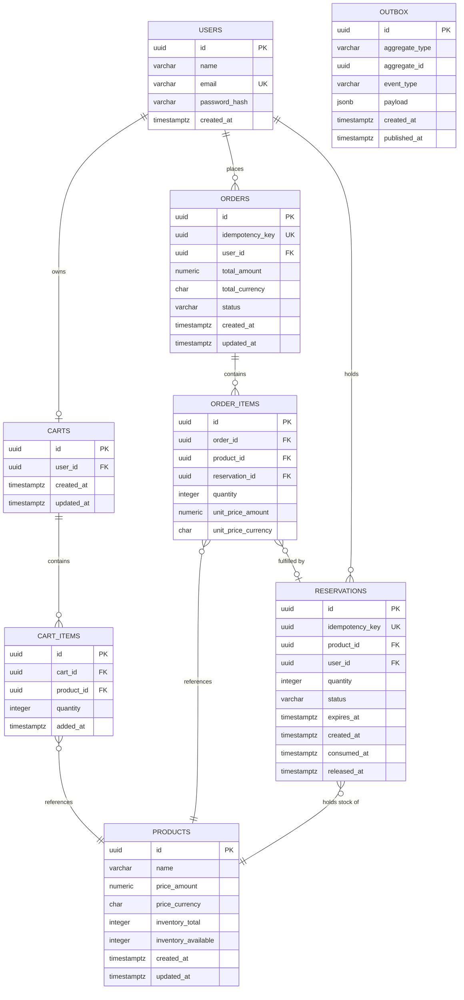

# Data Layer
 
This document covers the database models defined for this system. Though, other decisions related to datatypes used in tables and how data is stored in the database, can be found in the `adr` directory starting from the [7th decision](./adr/007-primary-keys.md). These decisions are one-way doors — changing any of them after the fact is painful — so each gets its own thinking. They are crucial for the data integrity. For the application-level data access patterns (the `repo/` wrapper layer, sqlc usage), see [code-architecture.md](./code-architecture.md). For the broader purchase-flow design that motivates the inventory choice, see [system-design.md](./system-design.md).

## Schema overview
 
The data model centers on eight tables. `users` and `products` are the foundational entities; carts and orders are decomposed into header + line-item pairs rather than embedding arrays of products on a single row; reservations sit beside orders, tracking in-flight inventory holds; the outbox table carries events to be published asynchronously after a successful purchase.
 

## What's deferred
 
A few related data-layer decisions that aren't urgent now but will become relevant:
 
- **Multi-warehouse inventory** — per-`(product, warehouse)` counts with routing logic to pick which warehouse fulfills which order. Single-warehouse for now; adding it would mean splitting `inventory_*` columns into a `product_inventory` table keyed by `(product_id, warehouse_id)`.
- **Stock history / audit log** — who changed which `inventory_total` when. Useful for ops investigations but not required for correctness. A separate `inventory_changes` append-only table covers this cleanly when needed.
- **Soft delete on products** — products with sold history can't truly be hard-deleted without orphaning orders. Likely needs a `status` column on products (`'active'`, `'discontinued'`, `'deleted'`) and adjusted queries throughout the catalog service.
- **Currency conversion** — required if customers see prices in their local currency. Treating USD as canonical for now; deferred until a real multi-currency requirement appears.
Each has an obvious extension path that doesn't disturb the three decisions documented above.
 