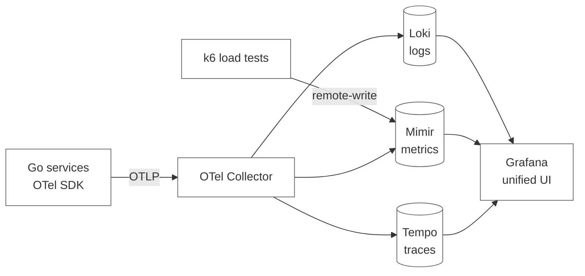

# Observability 

The third advantage is resource efficiency. Loki indexes labels, not log content, so it's roughly an order of magnitude cheaper to operate than Elasticsearch. Prometheus has been the gold standard for time-series storage for nearly a decade. Tempo doesn't index trace bodies at all — it stores them addressable by trace ID and relies on metrics with exemplars for discovery. The whole stack fits comfortably alongside the app on a single small VM, so time goes into instrumentation and dashboarding rather than JVM tuning and disk pressure.
 
The fourth is native integration with k6. Load-test metrics flow into the same Prometheus instance as the application metrics, which means a test populates the same dashboards as production traffic. Pushing a fix and watching the p95 curve flatten in real time, in the same panel that monitors live traffic, is a workflow no other stack matches as cleanly — both projects are by Grafana Labs, and it shows.
 
The fifth is industry adoption. Grafana, Prometheus, and OpenTelemetry appear constantly on job descriptions in 2026. ELK isn't dead, but new projects rarely pick it, and learning the LGTM stack means learning the direction the field is moving.

## Alternatives considered
 
**ELK plus Prometheus and Jaeger.** Mature, battle-tested, large community. The cost is operational: Elasticsearch is JVM-based and resource-hungry, the three tools have three UIs and three query languages, and correlation between them is manual. Worth a CV bullet but not the right fit when running everything on a small VM.
 
**Datadog, New Relic, Splunk, Honeycomb.** Excellent products, popular in industry, commercial and vendor-locked. For a learning project, the value is in *running* the stack — the operational lessons are the curriculum. Hides exactly the parts I personally want to learn. 
 
**Grafana Cloud (managed LGTM).** Same components as the self-hosted choice, operated by Grafana Labs, with a generous free tier that would shortcut deployment work. Rejected for this project because building and running the stack is itself a goal, switching to Grafana Cloud later for a hosted demo is a small lift.
 
**Roll-your-own with just Prometheus and structured log files.** The lightest possible option. Forfeits traces entirely and misses correlation. Not serious once traces are decided to matter.
 
## Component architecture
 

 
Each piece has one job. The **OTel Collector** is the central piece — the application talks only to it via OTLP, never to any storage backend directly. The collector receives, optionally processes (batching, sampling, attribute manipulation), and routes to the appropriate destination. This indirection is what makes the backends swappable and what lets new destinations be added (e.g., shipping errors to Sentry) without touching application code.
 
**Loki** stores logs, indexed by labels (`service`, `level`, `trace_id`) rather than full text — which is what keeps it cheap at the cost of slower content searches. The application's `slog` records flow through an `otelslog` bridge to the collector and on to Loki, with trace context attached. **Mimir** stores metrics — a Prometheus-API-compatible long-term store; both the application (via the collector) and k6 (via remote-write) write to it, and the shared `service` / `request_id` / `trace_id` labels propagate so metrics correlate with logs and traces. **Tempo** stores traces, addressable by trace ID; OTel context propagation across gRPC calls means a single trace covers gateway → order service → database → payment provider. **Grafana** is the query and visualization layer, with datasources provisioned declaratively and dashboards committed as JSON. Each LGTM component runs in its own container (Loki, Tempo, Mimir, Grafana) plus the OTel Collector — see `observability/docker-compose.yml`.

## Folder structure
 
```
observability/
├── docker-compose.yml              # The whole stack, independent of the app
├── otel-collector-config.yaml      # Pipelines: receivers, processors, exporters
├── mimir-config.yaml               # Single-tenant filesystem store, 7d retention
├── loki-config.yml                 # Storage backend, retention policy
├── tempo-config.yaml               # Trace storage, ingester settings
└── grafana/
    ├── provisioning/
    │   ├── datasources/
    │   │   └── datasources.yml     # Loki + Prometheus + Tempo URLs
    │   └── dashboards/
    │       └── dashboards.yml      # Where Grafana finds dashboard JSON
    └── dashboards/
        ├── service-overview.json   # RED metrics per service
        └── k6-load-test.json       # Load-test metrics overlaid on app metrics
```
 
A few decisions baked into this layout:
 
The whole stack lives in its own `docker-compose.yml`, separate from the application's compose file. This split matters operationally — restarting the app shouldn't lose logs and metrics, and developing on the observability stack shouldn't disturb the app. Both compose files share a Docker network so the collector can reach the services and Prometheus can scrape them.
 
The OTel Collector config (`otel-collector-config.yaml`) is the single most important file in this directory. It declares the pipelines: which receivers accept incoming telemetry (OTLP gRPC and HTTP), which processors transform it (batching, resource attribute upserts, optional tail-based sampling), and which exporters send it onward (Loki OTLP-HTTP, Mimir Prometheus remote-write, Tempo OTLP). Changing the storage backend means editing this file — not the application.
 
Dashboards live as JSON files under `grafana/dashboards/`, provisioned automatically on startup via `grafana/provisioning/dashboards/dashboards.yml`. Treating dashboards as code means they're versioned, reviewable, survive container restarts, and can be diffed in PRs. The convention is one dashboard per concern — `service-overview.json` for RED metrics, `k6-load-test.json` for load tests overlaid on app metrics — rather than one monolithic dashboard that tries to do everything.
 
Datasources are also provisioned declaratively in `grafana/provisioning/datasources/datasources.yml`, so a fresh Grafana container comes up already wired to Loki, Prometheus, and Tempo with no manual clicking. This is what makes the stack reproducible on a new server.
 
Retention policies live in the per-component config files (`loki-config.yml`, `tempo-config.yaml`, `mimir-config.yaml`). For a single-VM demo they're set short — a few days for logs, a week for metrics, a couple of days for traces — enough to debug incidents and run load-test comparisons, not enough to accumulate disk pressure.

## What's deferred
 
Things consciously not in this iteration, each with an obvious add-on path:
 
- **Alerting** via Alertmanager or Grafana-native alerts. SLO violations would be the natural starting point. Skipped because the load test in CI acts as the alert during development.
- **Continuous profiling** with Pyroscope. Worth adding once specific services are CPU- or allocation-bound and metrics alone aren't enough to pinpoint why. Pyroscope is also Grafana Labs and plugs into the same UI.
- **Long-term storage** via S3-compatible backends for Mimir, Loki, and Tempo. Out of scope while the data fits on the VM's local disk.
- **Synthetic monitoring** — external probes hitting user-facing endpoints from outside the network. Useful in production, overhead for a learning project.
None of these changes the fundamental design, they're additive when the project earns them.
 