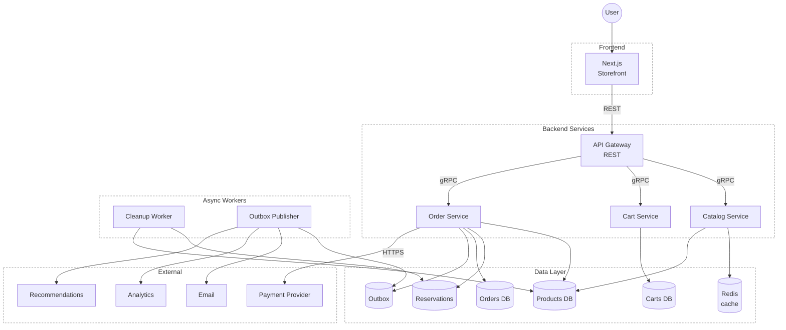
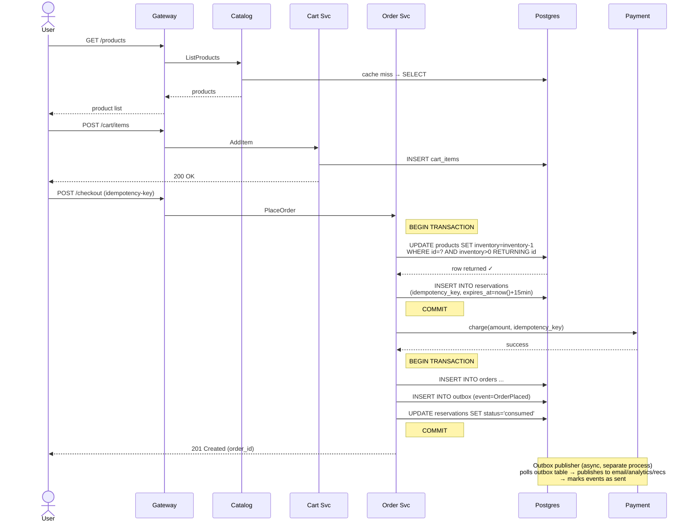
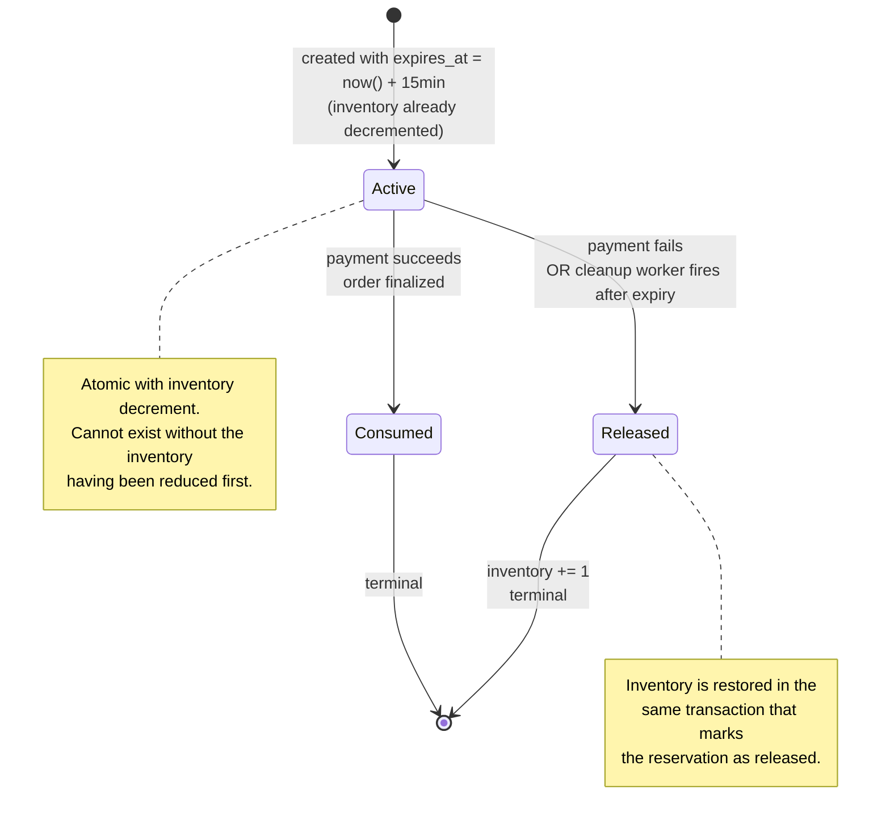
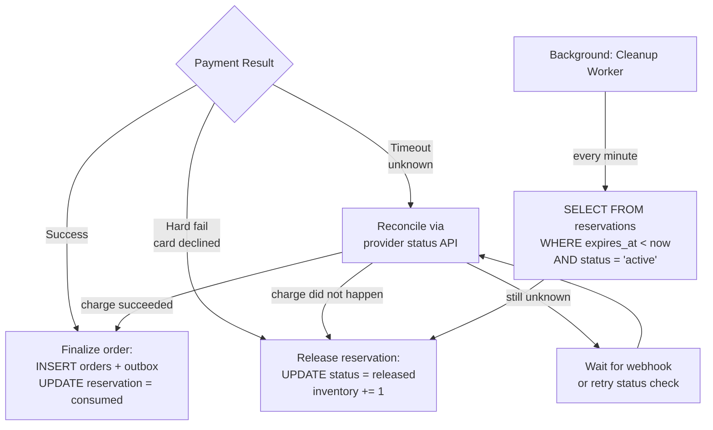

# System Design 

This document present the high overview system design of an application. This system ensures it can handle a real-world scenarios with a great deal of users traffic and a projected workload on the database. System is designed to face and effectively handle such concerns as: eventual consistency, partial failure, concurrency, with explicit and premeditated choices rather than accidental ones. 

## Overview 

The purchase flow of the application takes User from browsing products to purchasing the desired one, while guaranteeing that no item is oversold, no payment is ever lost or made twice, and no order is silently dropped - even with 10,000 customers trying to purchase the same product simultaneously even with only 10 units of it in stock.    

The patterns ensure this application's logic:

1) **Atomic conditional decrement** at the database for inventory contention.
2) **Time-bound reservations** to hold stock during the payment window without blocking other users. 
3) **The transactional outbox pattern** to fan out events to downstream services(email. analytics, recommendations) without the dual-write problem. 

Every other decision listed in the `adr` directory comes out of these three main concepts. 

## High-Level Architecture

Internal services communicate via gRPC, Client talks to the Gateway service over REST. Services that read from the Catalog use a cache-aside pattern against Redis, everything else hits DB directly thorugh `pgx`/`sqlc`.

## Purchase flow 

The two `BEGIN TRANSACTION`/`COMMIT` blocks are the two database transactions that anchor the whole flow and ensure that the Order and Inventory change are correctly processed. Everything else - apyment, fan-out can be failed and retried without corrupting state, because the source of truth is always the database.

## Reservation Lifecycle

Reservations prevent from overselling the product during the payment window. It has a defined lifecycle and handles payment failure and expiry of the reservation.

Key invariant here is that **a Reservation in `Active`/`Consumed` state will always result in inventory being decremented.** There is no scenarios where a reservation is created without the inventory change, and vice versa where the inventory cannot be decremented without a reservation.

## Failure Handling 

Payment **timeout** is a tricky one, because if the network crashes mid-charge we don't know whether money moved. So we need to be sure in order to release a reservation and rollback inventory. 
